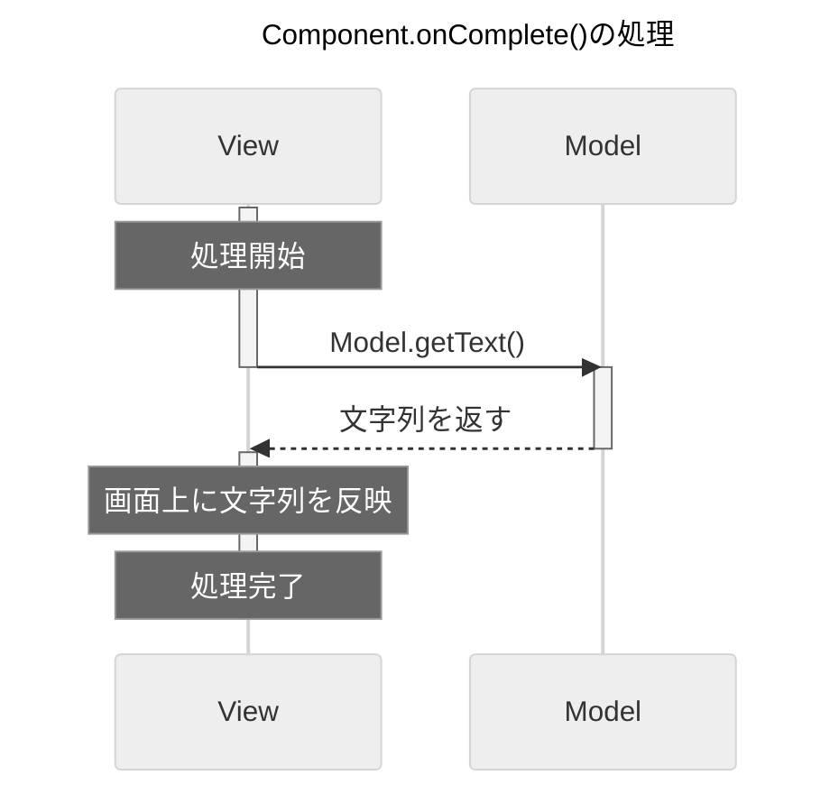

```mermaid
---
title: Component.onComplete()の処理
config:
  theme: neutral
---
sequenceDiagram
    participant View
    participant Model

    activate View
    note over View: 処理開始
    View->>Model: Model.getText()
    deactivate View
    activate Model

    Model-->>View: 文字列を返す
    deactivate Model
    activate View

    note over View: 画面上に文字列を反映
    note over View: 処理完了
    deactivate View
```